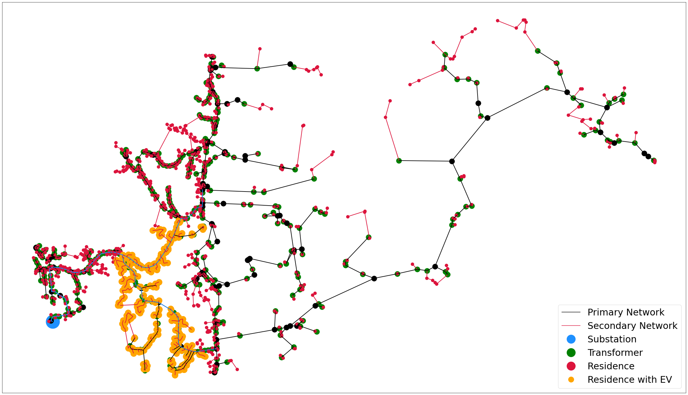
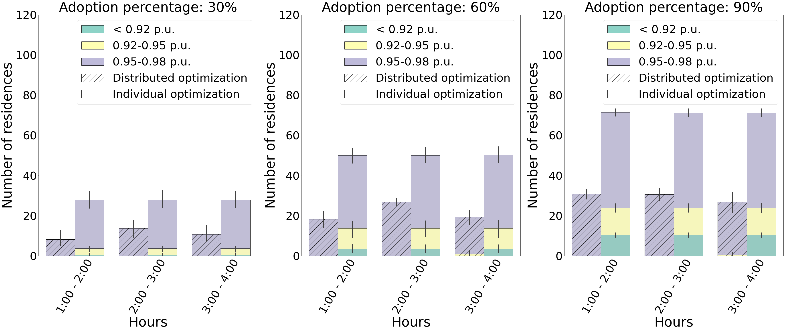
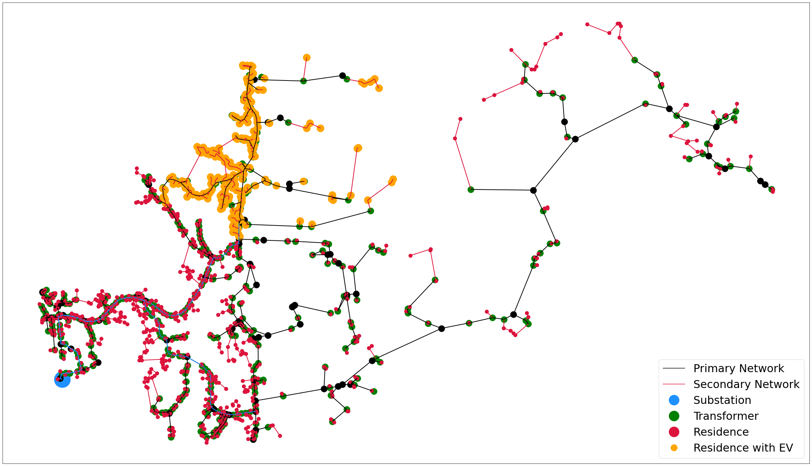
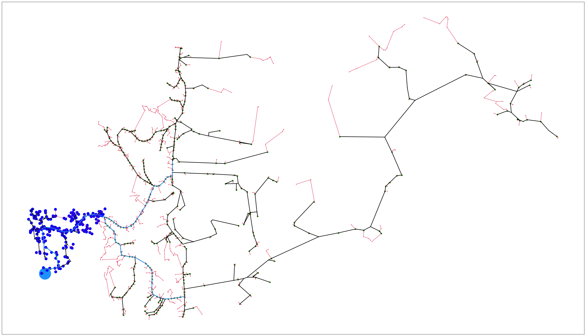
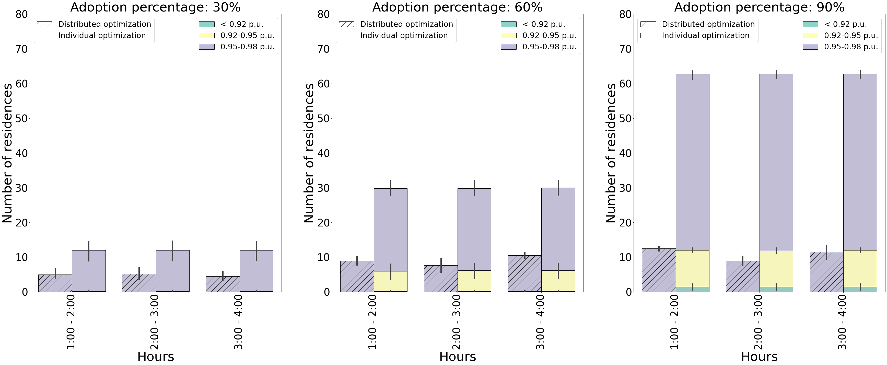
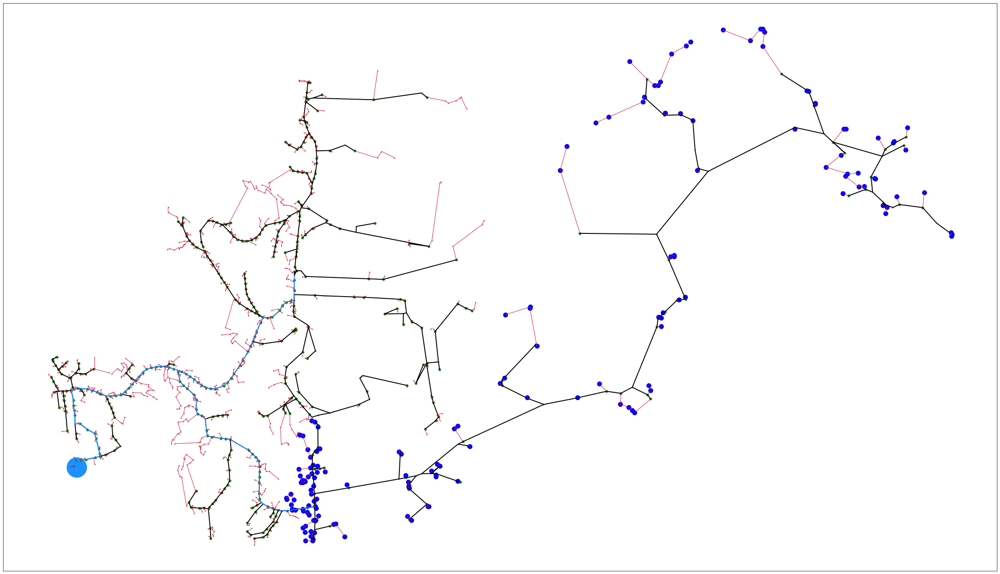
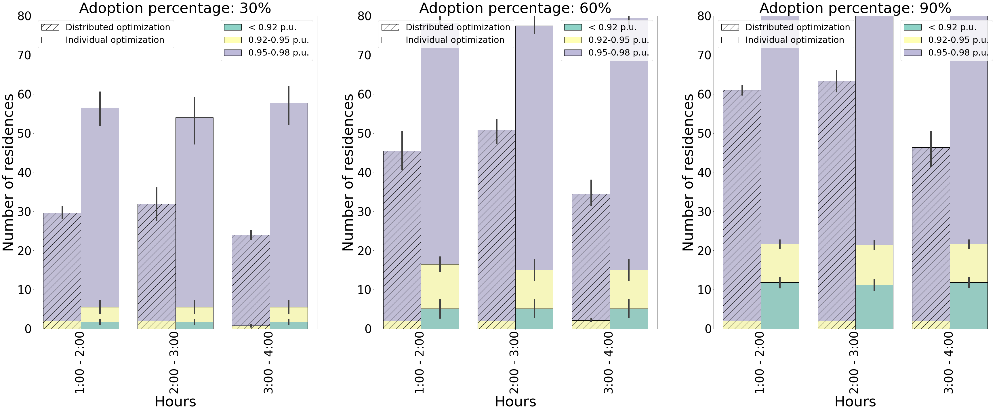
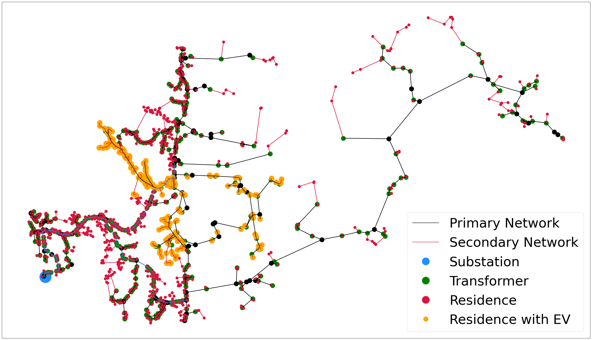
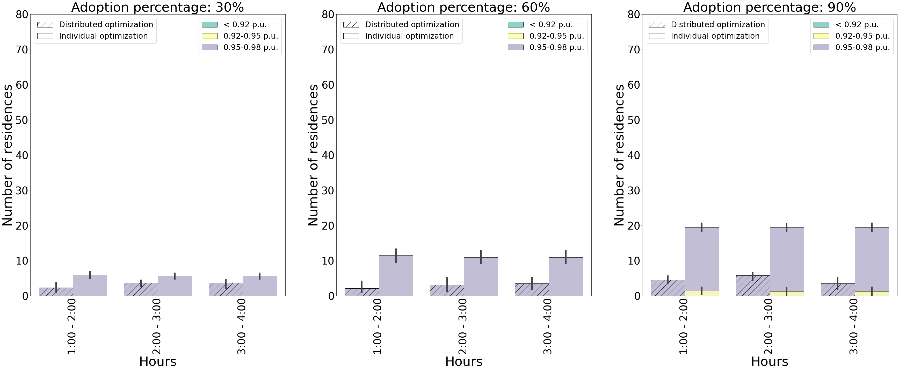

# REVS: Reliability-Aware EV charging Scheduler

Residential consumers have become active participants in the power distribution network after being equipped with residential EV charging provisions. This creates a challenge for the network operator tasked with dispatching electric power to the residential consumers through the existing distribution network infrastructure in a reliable manner. This project deals with problem of scheduling residential EV charging for multiple consumers while maintaining network reliability. An additional challenge is the restricted exchange of information: where the consumers do not have access to network information and the network operator does not have access  to consumer load parameters. 
The crux is a distributed framework which generates an optimal EV charging schedule for individual residential consumers based on their preferences and iteratively updates it until the network reliability constraints set by the operator are satisfied. 

### Effect of multiple adoption level in Com-A of the network
    

### Effect of multiple adoption level in Com-B of the network
    

### Effect of multiple adoption level in Com-C of the network
    

### Effect of multiple adoption level in Com-D of the network
    

### Effect of multiple adoption level in Com-E of the network
    
